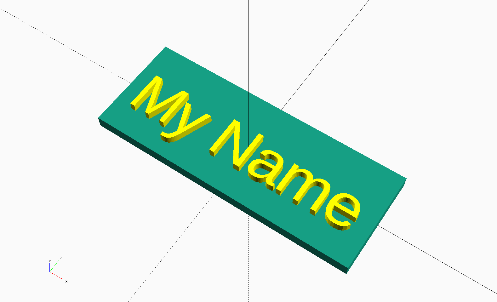
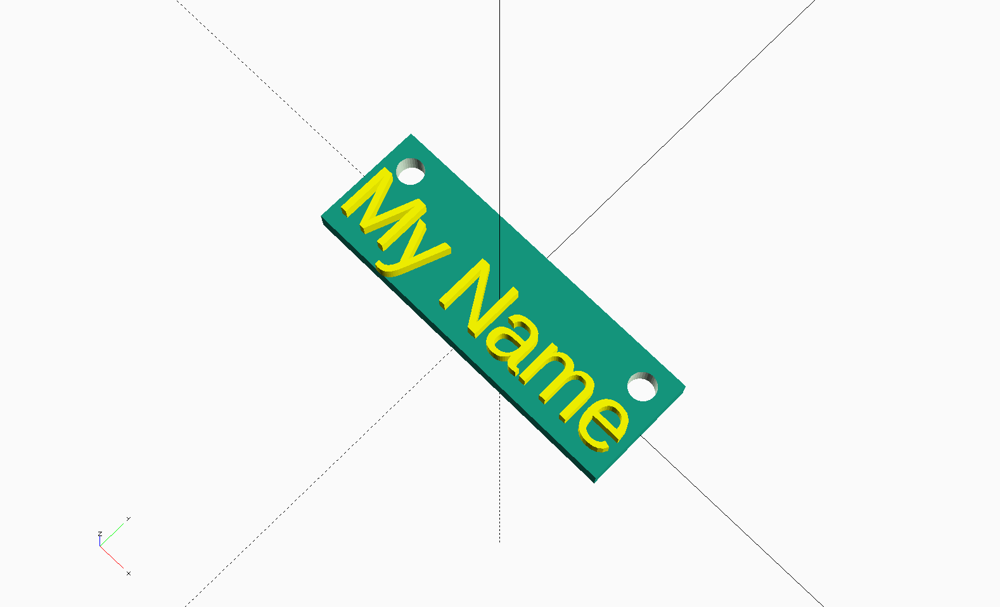

# Removing Unwanted Bits

## Objectives:
* Practice using `difference()`
* Practice thinking parameterically

You were probably tempted to move the text using hard-coded values like this:
```
    module makeTag() {
      union() {
        base();
        translate([0, -3, 1.5]) textExtrude();
      }
    }
```



That should put the text just about out of the way of the holes, but the text size is adjusted or the base size is changed, the text will look a bit odd.


Instead consider moving the text so that it moves relative to the size of the base. Just like the holes, the text will move with the size of the base rather than being static. In this example the text moves down by 1/5 of the ySize and the text floats exactly at the surface of the base.
```
    module makeTag() {
      union() {
        base();
        translate([0, -ySize/5 , zSize/2]) textExtrude();
      }
    }
```

Finally you need to add the mounting holes using `difference()`. Difference starts with the top level object (first listed) and then begins removing each subsiquent object from the first any where the objects intersect. In this case the `union()` of base and text makes an new single object.


  1. Add a `difference()` statement to module `makeTag()`

```
    module makeTag() {
      difference() {
        union() {
          base();
          translate([0, -3, 1.5]) textExtrude();
        } //end union
      } // end difference
    } // end makeTag()
```
  2. Check that the result looks like the image above. Nothing should have been subtracted yet.
  3. Add a call to the `holes()` module below the `union()`statement to make the mounting holes
```
    module makeTag() {
      difference() {
        union() {
          base();
          translate([0, -3, 1.5]) textExtrude();
        } //end union
      } // end difference
        #holes(); // turn on debuging to check the location, remove the '#' once done
    }  // end makeTag()
```
  4. The final model should look like this:


### Challenge:
* Make the base a different color
* Use multiple fonts
* Use multiple shapes for the base
* Make a hexagonal base or a star shaped base

### Questions:
* What are some of the benefits for making models parametric?
* What are some of the disadvantages of hard-coding values?
* Explain how you think the `difference` and `union` commands work to someone else.

[<< Lesson 9 - Joining it All Together](./Lesson9_Joining_Together.md) | [Lesson 11 - Publishing to Thingiverse](./Lesson11_Publish.md)
