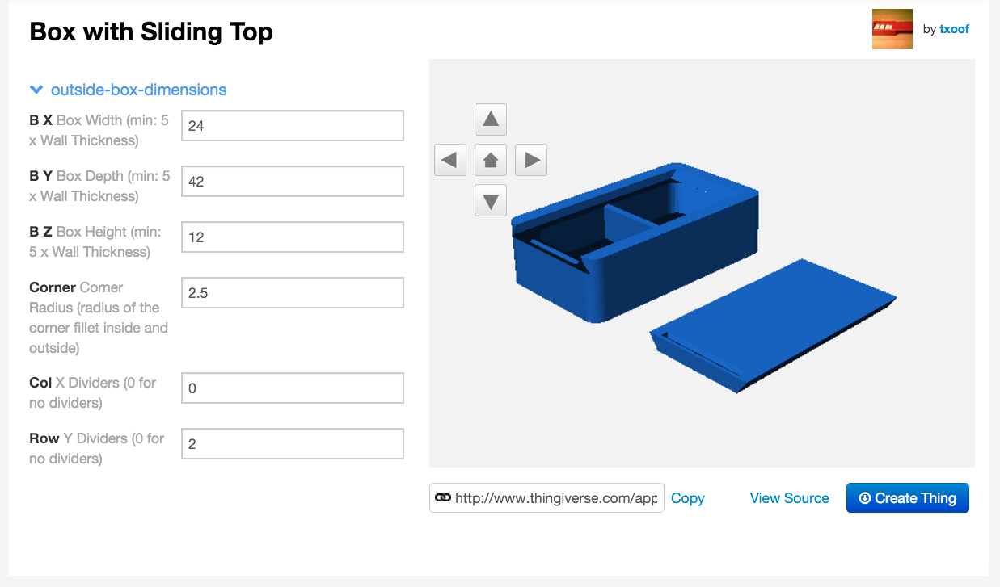

# Publish to Thingiverse
## Objectives:
* Setup variables for Customizer

The last step is to publish this thing onto the Thingiverse. Once you have published it anyone with an account can use the Customizer to make derivative things. This is great! You can share you ideas with other people and they can run with your ideas and make them bigger, more atristic, more rediculous and generally more awesome.

The first step is making sure your thing is easy to customize. We've started out on the right foot by creating logical variable tabs and giving the variables sensible names:
```
    /* [Base] */
    xSize = 45; // length
    ySize = 15; // height
    zSize = 3; //thickness
    holeDia = 3.5; // hole diameter

    /* [Text] */
    textHeight = 2;
    textSize = 7.5;
    myFont = "Liberation Sans";
    myColor = "yellow";
```
The next step is to take advantage of some of the [Customizer Markup](http://customizer.makerbot.com/docs). Any variable without specific markup will simply be a user-input field.



Sometimes we want to limit the range of valid inputs. This can be done by using a range.

  1. Add a range using the following format: // [minimu:maximum] description

```
     /* [Text] */
     textHeight = 2; // [1:10] height of text over base
     textSize = 7.5; // [1:50]
```

It is also possible to add a drop down menu of pre-populated options using list. Here's an opportunity to return to the font face choice. In version 2015.03-2 it is possible to use all of the system-installed fonts, but those fonts are not available on Thingiverse. Check the documenation wiki for more information on [fonts](https://en.wikibooks.org/wiki/OpenSCAD_User_Manual/The_OpenSCAD_Language#Text] and [colors](https://en.wikibooks.org/wiki/OpenSCAD_User_Manual/The_OpenSCAD_Language#color).

  2. Add a list of options using the following format: // [option1, option2, option3]
```
    myFont = "Liberation Sans"; // [Liberation Mono, Liberation Sans, Liberation Sans Narrow and Liberation Serif]
    myColor = "yellow"; // [green, yellow, blue, red, silver, black] Text color
```
One other useful customizer section is the /*[Hiden]*/ section. This section, as the name implies is hidden from view. This is a great spot to do calculations or set up variables for use elsewhere. If you know that you will be dividing a variable by 2 every time you use it Such as the holeDiameter, set this value in the Hidden section.

When writing a program, if you do something more than twice by hand, you should consider finding another way of doing it.  Every time you divide by 2, or add two variables together manually you risk a typo that you will need to find and correct later. By limiting the number of times you make a particular calculation debugging and changes become much, much easier.

  3. Add a `/* [Hidden]  */` section and add a variable for `holeRad = holeDia/2;`
  4. Update your code to use `holeRad` in the `holes()` module.

## Questions:
* What types of variables in this project should be set as a range?
* What things should be set as a drop down list? Why?
* Can you think of a specific instance where you would want to prevent a user from inputting a specific value? What about when division is involved?
* How can the `[Hidden]` section be useful to you as a designer? 
    * How is it useful to other people that review your designs?
* How can setting variables under the Hidden section save you from errors later?
