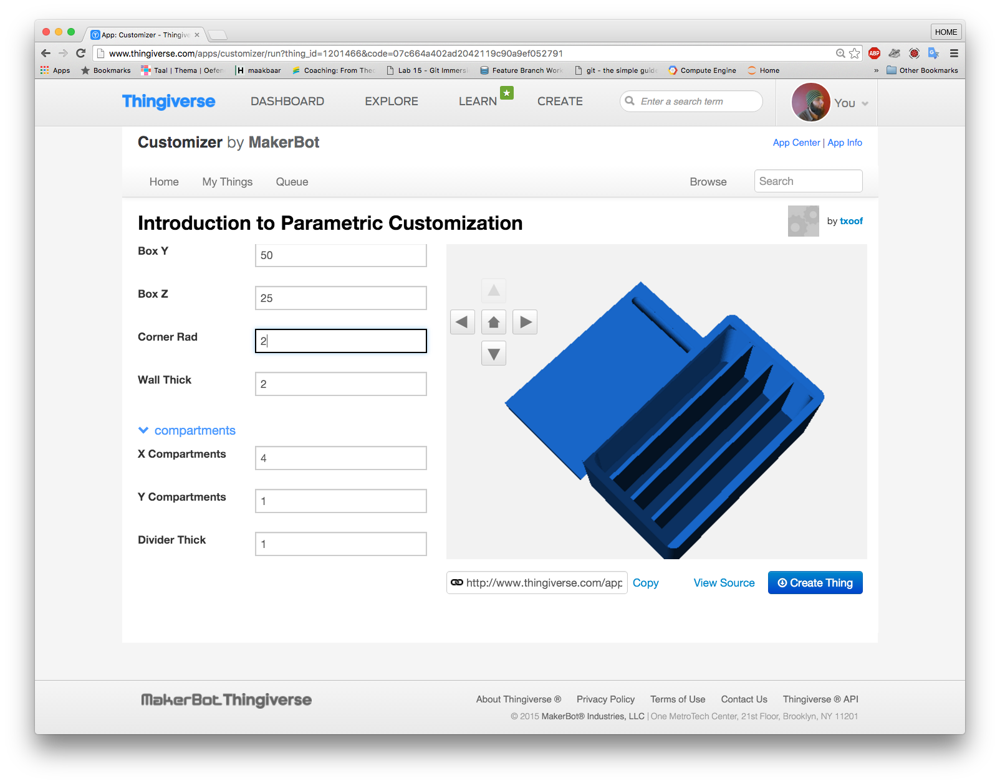

# Introduction to the Customizer
The Thingiverse and Openscad offers users the ability to display their models and designs through a sort of gallery.  The gallery can contain images, pdfs, zipped files STL models, OpenSCAD source files and many other file types. 

Most models on the Thingiverse are STL files. These are sort of like loaves of bread; they have been made to a recipe with a program like Rhino, Sketchup, Blender or OpenSCAD. They are more-or-less immutable and cannot be changed without a special STL editor.

OpenSCAD files are more of a recipe than a finished product. The recipe can be tweaked and modified to suit a particular need. When OpenSCAD is instructed to 'render' a design, it runs the recipe and bakes the finished product.  Some OpenSCAD designs are more tweakable than others depending on how they are created.

Explore the design below and see what can be manipulated. Think about this might be useful.

1. Open [this thing at Thingiverse.com](http://www.thingiverse.com/thing:1201466/) and launch the customizer
   * Note: You will need a free Thingiverse account.  If you do not have/want a thingiverse account please skip to Lesson 2
2. Play around with the customizable elements.  Try to make a box that has the following dimensions:
   * X: 30, Y: 50, Z:25
   * Wall thickness: 2
   * xCompartments: 4
   * yCompartments: 1 
  

3. Create an STL and download it later by clicking on the "Create Thing" link.

### Questions:
* What could you customize on this box?
* Why is it useful to be able to customize objects?
* In what cases would a designer **not** want to provide a customizable object?
* What happened as you input different values?
* Which features did not seem to work properly?
* What features would you like to add to this object?

[<< Lesson 0 - Introduction](Readme.md) | [[Lesson 2 - Customizing in OpenSCAD >>](./Lesson2_OpenSCAD.md)
