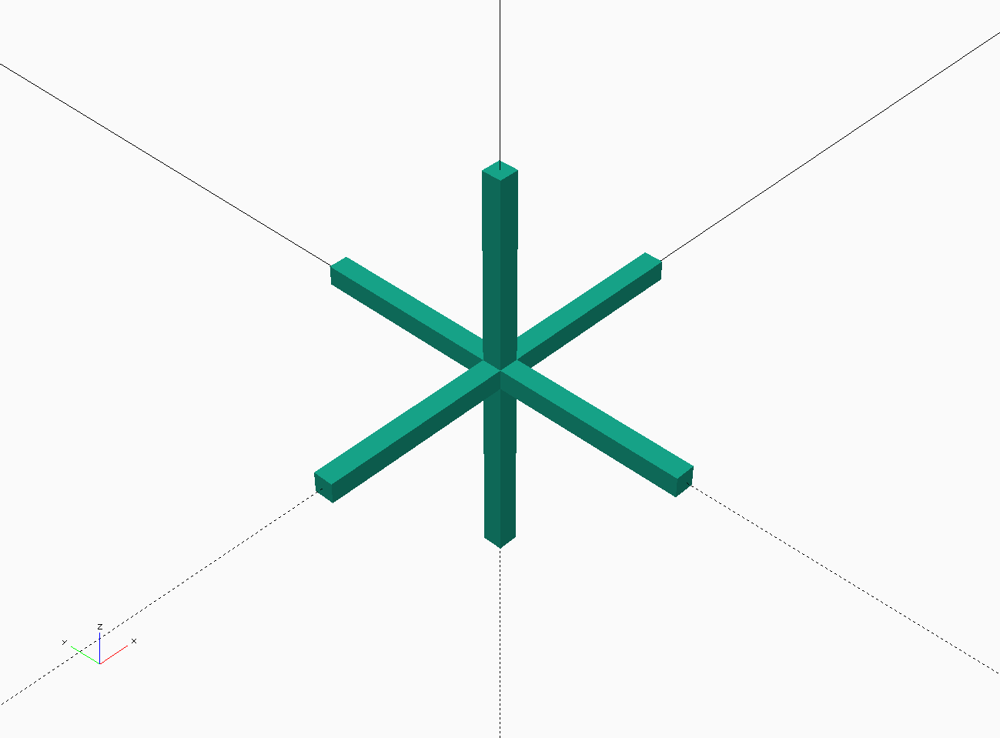
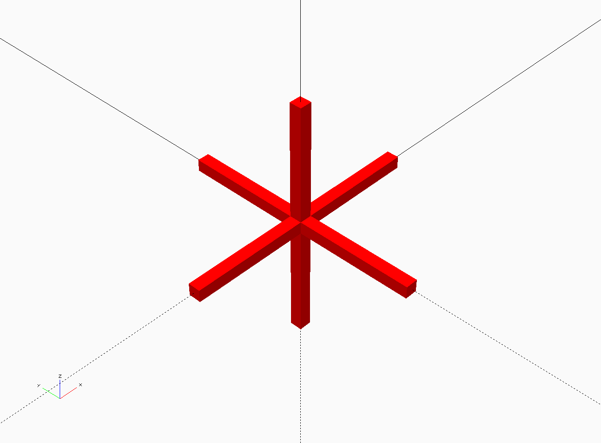

# Variables
This section is a little dry and doesn't have a lot of practical things to do. It is pretty important though so this might be a good time to stretch your legs and get a cookie or an apple before you continue.

The changes you were making under the [ Outside Dimensions ] sections were to 'variables.'Variables in OpenSCAD are containers that can hold integers (1, 2, -99999990002), real numbers (-1.123, 6.022, 99.4), boolean (true, false), arrays ([0, 5, 100], [[3, 4 5], [55, 0, 2]]) and text ('Hello world!').

Variables are a convenient way to store values in an easily identifiable package. This method also makes OpenSCAD projects easier to edit and make adjustable.  Compare the examples below:

Example 1:
```
    union() {
          cube([5, 5, 30], center = true);
          cube([5, 30, 5], center = true);
          cube([30, 5, 5], center = true);
     }
```

Example 2:

```
    short = 5;
    long = 30;
    union() {
           cube([short, short, long], center = true);
           cube([short, long, short], center = true);
           cube([long, short, short], center = true);
      }
```


Both examples make exactly the same shape. Copy and paste example 1 into a new OpenSCAD file.  
1. Try and adjust Example 1 to match the image shown below. 
    - Hint the values are 2 and 40.
2. Now try with Example 2
  - If you're anything like me, you probably skipped the steps above and said, 'Yeah, yeah, I get it.'. I encourage you to give step 2 a try just so you can actually try out using variables in a clean space where you can't break too much.
  


3\. Try out example 3 below. This one is really surprising if you are new to OpenSCAD.
###

Example 3:
```
    short = 5;
    long = 30;
    union() {
        cube([short, short, long], center = true);
        cube([short, long, short], center = true);
        cube([long, short, short], center = true);
    }

    short = 2;
    long = 40;
    color("red")
    union() {
        cube([short, short, long], center = true);
        cube([short, long, short], center = true);
        cube([long, short, short], center = true);
    }
```
You probably expected to get this:


But you should have seen this:



This is because OpenSCAD does not handle variables in the same way as say Python or another programing language you may have used. It calculates all the variables first and uses the last state they are in when it begins drawing. This means you need to be aware of the 'scope' of your variables. More on this later. I'm just planting the seeds here.

Something to keep in mind when you create variables is that they are not just for your reference NOW, but also for you and others in the future. Just because 'foo' and 'dog' look like great variables for a one-off project now, they won't be at all helpful in six hours when you come back to a section that started out as a test and turned into something useful. Try to use useful names. I like to be as descriptive as possible while keeping my variable names short. I also like to use cammelCappedNames or under_scored_names. 

In many programming languages variables that start with a Capital Letter are treated in a special way. It is good habit to start your variables with a lower case. Also, most languages will try to interpret dashes as a literal subtraction. A variable named-like-this in OpenSCAD literally means: 'named' minus 'like' minus 'this'.  Ugg. 

#### Questions:
* How can variables make your OpenSCAD designs better?
* What are some things to think about when naming a variable?  
    * Explain to someone else how you will name your variables.
* What happened in example 3? 
    * Explain to someone else why you got that result.


[<< Lesson 2 - Customizing in OpenSCAD](./Lesson2_OpenSCAD.md) | [Lesson 4 - Working With Modules >>](./Lesson4_Modules.md)
