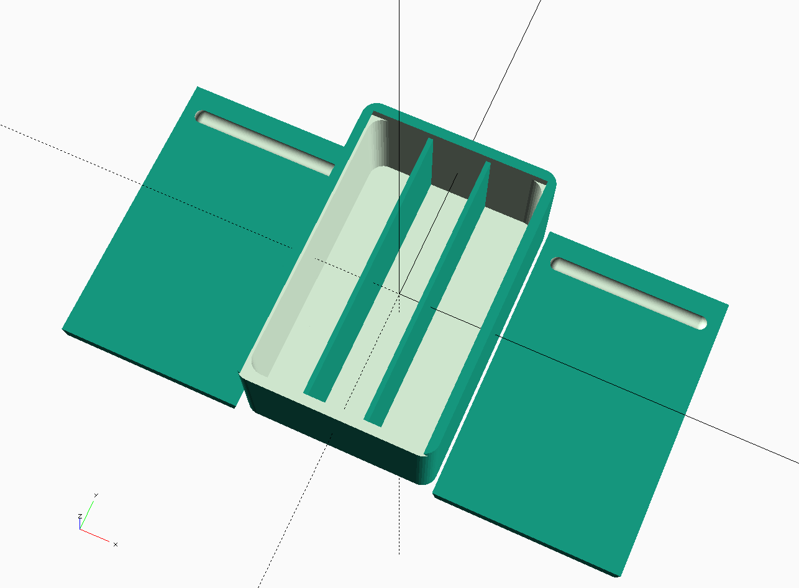

# Working with Modules
This lesson has lots of opportunities to make mistakes and break stuff.  It should be a bit more fun than the previous section. If you totally bork up the file, download another copy and start over.

Modules are sort of a special variable name that holds a recipe to do stuff. A module can do stuff and can also call to other modules and make them do stuff.

In this lesson you will work with the `dividedBox()` module that calls several other modules to draw the box, divide it up and add a lid.  You are about to add some extra lids to the model. Maybe you want to make sure you have a backup lid?

1\. Locate the module `dividedBox()` and find the section that looks like this:
    * HINT: use ctrl-f or cmd-f to search the code for `module dividedBox()`
```
    translate([-boxX, 0, -boxZ/2+wallThick/2])
        rotate([0, 180, 0])
        lid();
```
  This section is actually all one line that does three things: 
  - moves the drawing 'pen' from 0, 0, 0 to the left side of the box
  - rotates the drawing surface
  - draws the lid()

2\. Try to add a second lid to the right side of the box.  
    - Hint 1: copy and paste the code above directly under the existing code
    - Hint 2: everything should be exactly the same except for one character.
    - Hint 3: you need to move the second lid in the positive X direction

3\. CHALLENGE: Add a third and fourth lid in front and behind the box.
  - Hint: most of the code is the same once again, but you will need to move in the Y axis.




[Lesson 3 - Variables](Lesson3_Variables.md) | [Lesson 5 - >>](./Lesson5_.md)
