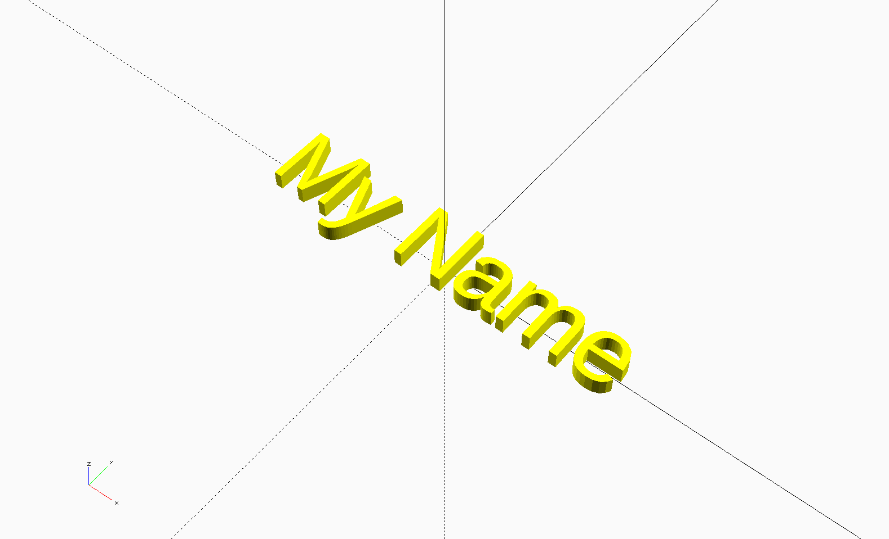

# Add Extruded Text
In openscad 2015.03 text support was added officially. Using the `linear_extrude()` built-in raised and embossed text can be easily added to projects.

The [linear_extrude()](https://en.wikibooks.org/wiki/OpenSCAD_User_Manual/The_OpenSCAD_Language#Linear_Extrude) module has many features. We will only be using it in the most simple form here. See the OpenSCAD wiki for more information on other features.

Your next task is to add a module that will provide extruded text. Sometimes it is helpful to turn everything else off while you are working on a new feature. This can be done by simply adding a // in front of any line that you do not wish to execute.

Think back to the list of variables you made in the previous lessons. What variables do you think will be needed for the text?



  1. Comment out the `base()` and `holes()` modules:
```
    //base();
    //holes();
```
  2. Create a variable block for customizing text under the [Base] block:
```
    */ [Text] */
    textHeight = 2; // height over base
    textSize = 7.5; // text size
    myColor = "yellow" // color in rendering
    myFont = "Liberation Sans" // more on this later!
```
  3. Create a module for creating extruded text:
```
    module textExtrude() {
      // the following four lines are all actually one command that ends with the ';'
      color(myColor)
        linear_extrude(height = textHeight)
        text("My Name", halign = "center", valign = "center", size = textSize,
          font = myFont);
    }
```
  4. Test out your code; make sure everything else is commented out
```
    //base();
    //holes();
    textExtrude();
```
  5. This project is super boring with "My Name" on the plaque. Let's make that customizable. Add another variable under the [Text] block for customizing the text. Make sure you use that variable appropriately in the extrude module.

## Questions:
* What did you need to do to make the text more customizable?
* What do you think we need to do to join all these pieces together?

[<< Lesson 7 - Add Mounting Holes](./Lesson7_Mounting_Holes.md) | [Lesson 9 - Joining it All Together >>](./Lesson9_Joining_Together.md)
